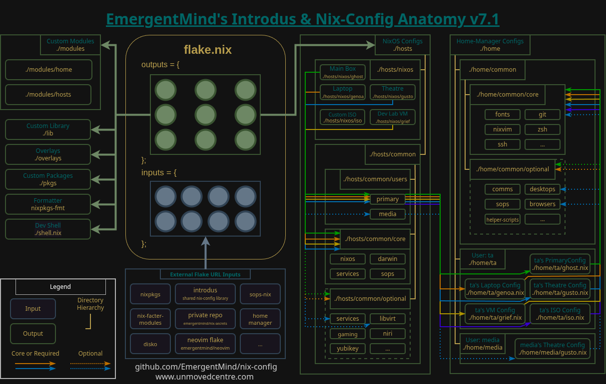

<div align="center">
<h1nsta>
 <br>
</h1>
</div>

# EmergentMind's Nix-Config

> Where am I?
>
> > You're in a rabbit hole.
>
> How did I get here?
>
> > The door opened; you got in.

Somewhere between then and now you discovered this cairne in the fog. I hope it is useful in some way. Inspiration, reference, or whatever you're looking for.

This is written perhaps as more of a reminder for myself than it is for you, but then again you could be future me or maybe past me stuck in a strange loop...

```bash
$ whoami
error: entity unknown or undefined
```

Steady...

The way out, is through.

## Table of Contents

- [Feature Highlights](#feature-highlights)
- [Roadmap of TODOs](docs/TODO.md)
- [Requirements](#requirements)
- [Structure](#structure-quick-reference)
- [Adding a New Host](docs/addnewhost.md)
- [Secrets Management](#secrets-management)
- [Initial Install Notes](docs/installnotes.md)
- [Troubleshooting](docs/TROUBLESHOOTING.md)
- [Tags and Branches](#a-quick-note-on-tags-and-branches)
- [Acknowledgements](#acknowledgements)
- [Guidance and Resources](#guidance-and-resources)

---

Watch NixOS related videos on my [YouTube channel](https://www.youtube.com/@Emergent_Mind).
Chat with me directly on our [Discord server](https://discord.gg/XTFg57xGxC).

**April 30, 2026:** This and other nix related repos by EmergentMind on GitHub are now mirrored from repos of the same name at [https://codeberg.org/EmergentMind/](https:bd://codeberg.org/EmergentMind/). Depending on which domain you are visitng the commit signing before and after this change may show as unverified. Also, many of the reference URLs throughout may still point back to github until I get around to correcting them.

## Feature Highlights

- Flake-based multi-host, multi-user configurations for NixOS and Home-Manager

  - Optional configs for user and host-specific needs
  - Facilitation for custom modules, overlays, packages, and library

- Secrets management via sops-nix and a _private_ nix-secrets repo that is included as a flake input
- Declarative, LUKS-encrypted btrfs partitions via disko
- Impermanence - files that aren't explicitly persisted are deleted on reboot
- Automated remote-bootstrapping of NixOS, nix-config, and _private_ nix-secrets
- Handles multiple YubiKey devices and agent forwarding for touch-based/passwordless authentication during:

    - login
    - sudo
    - ssh
    - git commit signing
    - LUKS2 decryption

- Automated borg backups
- NixOS and Home-Manager automation recipes

The roadmap of additional features is laid across functionally thematic stages that can be viewed, along with short term objectives, in the [Roadmap of TODOs](docs/TODO.md).

Completed features will be added here as each stage is complete.

## Requirements

- Patience
- Attention to detail
- Persistence
- More disk space

This is a personalized configuration that has several technical requirements to build successfully. This nix-config will serve you best as a reference, learning resource, and template for crafting your own configuration. I am continuing to provide resources throughout this repository, my [YouTube channel](https://www.youtube.com/@Emergent_Mind), and [website](https://unmovedcentre.com) to help. For you to be successful, you must also experiment and learn as you go to create a nix environment that suits your needs.

A stripped down and simplified version of this repository is available, however it does not have feature parity: [nix-config-starter](https://github.com/EmergentMind/nix-config-starter)

## Structure Quick Reference

For details about design concepts, constraints, and how structural elements interact, see the article and/or Youtube video [Anatomy of a NixOS Config](https://unmovedcentre.com/posts/anatomy-of-a-nixos-config/) available on my website.

For a large screenshot of the concept diagram, as well as previous iterations, see [Anatomy](docs/anatomy.md).

<div align="center">
<a href="docs/anatomy.md"></a>


As of September 2025, we've been rethinking how to handle multiple users and the concept for Home is in a bit of flux. Some of the changes are reflected below but the latest diagram here represents the iteration prior to these changes until I have a better idea what the outcome will be and how to visually represent it.
</div>

- `flake.nix` - Entrypoint for hosts and user home configurations. Also exposes a devshell for  manual bootstrapping tasks (`nix develop` or `nix-shell`).
- `hosts` - NixOS configurations accessible via `sudo nixos-rebuild switch --flake .#<host>`.
  - `common` - Shared configurations consumed by the machine specific ones.
    - `core` - Configurations present across all hosts. This is a hard rule! If something isn't core, it is optional.
    - `optional` - Optional configurations present across more than one host.
    - `users` - Host level user configurations present across at least one host.
        - `<user>/keys` - Public keys for the user that are symlinked to ~/.ssh
  - `nixos` - machine specific configurations for NixOS-based hosts
      - `genoa` - ThinkPad E15 - 3.5/4.7GHz i7-1255U (6C/12T), 16GB RAM
      - `ghost` - Primary box - 4.8GHz Ryzen 9 5900XT (16C/32T), 64GB RAM, RX 9070XT
      - `grief` - Lab - Qemu VM
      - `gooey` - stage x
      - `guppy` - Remote Install Lab - Qemu VM
      - `gusto` - Theatre mini pc - 3.4GHz N95 (4C/4T), 16GB RAM
      - `iso` - Custom NixOS ISO that incorporates some quality of life configuration for use during installations and recovery
- `home` - Home-manager configurations, built automatically during host rebuilds.
  - `common` - Shared home-manager configurations consumed the user's machine specific ones.
    - `core` - Home-manager configurations present for user across all machines. This is a hard rule! If something isn't core, it is optional.
    - `optional` - Optional home-manager configurations that can be added for specific machines. These can be added by category (e.g. options/media) or individually (e.g. options/media/vlc.nix) as needed.
  - `<user>` - User-specific, host-specific configurations.
    - `common` - User-specific configurations common across that user's hosts.
- `lib` - Custom library used throughout the nix-config to make import paths more readable. Accessible via `lib.custom`.
- `modules` - Custom modules to enable special functionality and options.
    - `home` - Custom modules for home-manager
    - `hosts` - Custom modules for hosts
      - `common` - Custom modules applicable to hosts on either platform
      - `darwin` - Custom modules specific to darwin-based hosts
      - `nixos` - Custom modules specific to nixos-based hosts
- `overlays` - Custom modifications to upstream packages.
- `pkgs` - Custom packages meant to be shared or upstreamed.
    - `common` - Custom packages that will work on either nixos or dariwn
    - `nixos` - Custom packages specific to nixos-based hosts

## Secrets Management

Secrets for this config are stored in a private repository called `nix-secrets` that is pulled in as a flake input and managed using the sops-nix tool.

For details on how this is accomplished, how to approach different scenarios, and troubleshooting for some common hurdles, please see my article and accompanying YouTube video [NixOS Secrets Management](https://unmovedcentre.com/posts/secrets-management/) available on my website. There is also a [nix-secrets-reference](https://github.com/EmergentMind/nix-secrets-reference) repository that can be used in conjunction with the article.

## Support The Project

Sincere thanks to all of my generous supporters!

If you find what I do helpful, please consider supporting my work using one of the links under "Sponsor this project" on the right-hand column of this page.

I intentionally keep all of my content ad-free but some platforms, such as YouTube, put ads on my videos outside of my control.

## Guidance and Resources

- [NixOS.org Manuals](https://nixos.org/learn/)
- [Official Nix Documentation](https://nix.dev)
  - [Best practices](https://nix.dev/guides/best-practices)
- [Noogle](https://noogle.dev/) - Nix API reference documentation.
- [Official NixOS Wiki](https://wiki.nixos.org/)
- [NixOS Package Search](https://search.nixos.org/packages)
- [NixOS Options Search](https://search.nixos.org/options?)
- [Home Manager Option Search](https://home-manager-options.extranix.com/)
- [NixOS & Flakes Book](https://nixos-and-flakes.thiscute.world/) - an excellent introductory book by Ryan Yin
- [Impermanence](https://github.com/nix-community/impermanence)
- Yubikey
  - <https://wiki.nixos.org/wiki/Yubikey>
  - [DrDuh YubiKey-Guide](https://github.com/drduh/YubiKey-Guide)

## Tags and Branches

As with many personal projects, the code here tends to evolve away from what it was when the video/article content was published.

- Videos - To find code relevant to when a specific video/article was published, look through tags with the word 'video' as they are commits from roughly the same time.

- Darwin - To find relevant to handling hosts using both NixOS and Darwin, refer to the `darwin` branch. Starting in 2026, we are migrating away from Darwin support for the foreseeable future but will retain it 'as is' in the `darwin` branch for reference.

## Acknowledgements

Those who have heavily influenced this strange journey into the unknown.

- [FidgetingBits](https://github.com/fidgetingbits) - You told me there was a strange door that could be opened. I'm truly grateful.
- [Mic92](https://github.com/Mic92) and [Lassulus](https://github.com/Lassulus) - My nix-config leverages many of the fantastic tools that these two people maintain, such as sops-nix, disko, and nixos-anywhere.
- [Misterio77](https://github.com/Misterio77) - Structure and reference.
- [Ryan Yin](https://github.com/ryan4yin/nix-config) - A treasure trove of useful documentation and ideas.
- [VimJoyer](https://github.com/vimjoyer) - Excellent videos on the high-level concepts required to navigate NixOS.

---

[Return to top](#emergentminds-nix-config)
